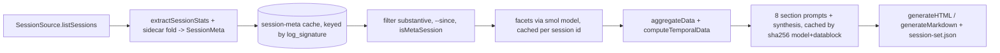

# Repository Guidelines

## Project Overview

`omp-insights` is an omp extension that registers `/insights`. It scans local session logs (omp: `~/.omp/agent/sessions`, or Claude Code: `~/.claude/projects` via `--source claude`), extracts deterministic stats (spend, tokens, tool errors, aborts, model switches), optionally runs LLM facet/section prompts, and writes a self-contained HTML report plus optional Markdown export and an audit manifest.

Port of Observal/pi-insights (Pi harness) to omp. AGPL-3.0-only; keep SPDX headers in `index.ts`. Versioning restarted at 0.1.0 for the fork.

## Architecture & Data Flow

`index.ts` (~680 lines) owns registration and the `runInsights` orchestrator; logic lives in `src/` modules. Tests import internals through the test seam at the bottom of `index.ts`, so new exports from `src/` that tests need must be re-exported there.

| Module | Responsibility | Key symbols |
|---|---|---|
| `index.ts` | Host API structural types (no `@omp`/Pi imports), flag parsing, `resolveLimit`, `runInsights`, extension entry, test seam | `ExtensionAPI`, `runInsights` |
| `src/types.ts` | Shared types | `SessionMeta`, `SessionFacets`, `AggregatedData`, `TemporalData`, `UserContext`, `SessionSource` |
| `src/sources/omp.ts` | omp log walker: sidecar discovery, dedupe by session id, transcript formatting | `createOmpSessionSource`, `formatTranscript` |
| `src/sources/claude.ts` | Claude Code adapter for `~/.claude/projects` | `createClaudeSessionSource`, `extractClaudeStats` |
| `src/stats.ts` | Per-session deterministic extraction | `extractSessionStats`, `buildSessionMeta`, `readUsage`, `toolErrorCategory`, `classifyErrorMessage` |
| `src/aggregate.ts` | Corpus aggregation, 10-day decay weighting, concurrency, tooling-session exclusion | `aggregateData`, `detectConcurrentSessions`, `excludeToolingSessions` |
| `src/temporal.ts` | Week-over-week deltas, anomalies, trajectory | `computeTemporalData` |
| `src/harness.ts` | Harness-change detection via persisted run-to-run snapshots (config/model-roles/skills/hooks/AGENTS.md, separate from temporal.ts) | `detectHarnessChanges`, `gatherHarnessSnapshot`, `loadHarnessSnapshot`, `saveHarnessSnapshot` |
| `src/cache.ts` | session-meta / facets / sections caches | `loadCachedMeta`, `saveMeta`, `loadCachedSections`, `pruneSections` |
| `src/context.ts` | User context from `~/.omp/agent` (config.yml incl. memory backend, skills, managed-skills, extensions) | `gatherUserContext`, `parseSimpleYaml` |
| `src/model.ts` | Shells out to `omp -p` | `callModel`, `parseJsonFromResponse` |
| `src/prompts.ts` | Facet/section/synthesis prompts | `FACET_EXTRACT_PROMPT`, `buildFeaturesReference`, `filterSuggestions`, `filterByEvidence`, `buildSectionPrompts` |
| `src/render/html.ts`, `src/render/md.ts` | Report output | `generateHTML`, `generateMarkdown` |

Pipeline in `runInsights`:



Patterns to preserve:
- `SessionSource` interface abstracts omp vs Claude layouts; add new sources as factories, not branches in the orchestrator.
- Sidecars (`__advisor.jsonl`, subagent logs under `TIMESTAMP_SESSION-ID/`) are folded into the parent as `cost_primary/cost_advisor/cost_subagent`; never surface them as top-level sessions. Spill files (`*.bash.log`, `*.read.log`, `*.eval.log`) are ignored.
- Cost is read from explicit `usage.cost.total`; tool errors from boolean `toolResult.isError`. Do not reintroduce price tables or regex error bucketing (deleted Pi workarounds).
- Three cache tiers under `~/.omp/agent/usage-data/`: `session-meta/<source>-<id>.json` (size:mtime signature), `facets/<id>.json` (cleared by `--refresh`), `sections/<hash>.json` (newest 5 kept).
- Re-run without `--refresh` must make zero facet LLM calls; `--no-llm` renders from cache with zero spend.
- `gatherUserContext` must return the user's real skills (both `skills/` and `managed-skills/`, >= 50 on a typical install), extensions, and default model. A report recommending an already-installed skill is a bug.

### omp session log schema

Layout under `~/.omp/agent/sessions/<slugified-cwd>/`: `<ISO-ts>_<session-id>.jsonl` (primary) plus sibling dir `<ISO-ts>_<session-id>/` with `__advisor.jsonl`, subagent logs, and `*.bash.log`/`*.read.log`/`*.eval.log` spill. Record types seen per `.type`: `session`, `message`, `custom`, `model_usage`, `thinking_level_change`, `model_change`, `title_change`, `credential_pin`.

```jsonc
{"type":"session","version":3,"id":"<uuid>","timestamp":"...","cwd":"/path","title":"..."}
{"type":"model_usage","purpose":"auto-thinking","role":"tiny","provider":"anthropic","model":"claude-haiku-4-5",
 "usage":{"input":537,"output":4,"cacheRead":0,"cacheWrite":0,"totalTokens":541,"cost":{"input":0.000537,"output":0.00002,"cacheRead":0,"cacheWrite":0,"total":0.000557}}}
{"type":"message","id":"...","parentId":"...","timestamp":"...","message":{ /* role: user | assistant | toolResult */ }}
// assistant:  {content[], model, provider, usage, ttft, duration, stopReason, responseId}
// toolResult: {content[], toolName, toolCallId, isError, details}
// user:       {content[], attribution, steering}
```

Session id and start time come from the `session` record; project from its `cwd`. `steering` marks user interruptions, `parentId` threads turns, `thinking_level_change`/`model_change` are mid-session escalation signals.

## Key Directories

- `index.ts`: orchestration and entry; `src/`: modules per the table above; `src/sources/` adapters; `src/render/` output formats.
- `docs/how-it-works.html`: standalone explainer of the pipeline.
- `test/`: `node:test` suites, one per concern (`scanner`, `stats`, `friction`, `claude-source`, `report`, `config`).
- `test/golden/report.md`: byte-exact Markdown golden.
- `tools/verify-cost.sh`: jq cross-check of report totals against raw logs.
- `.github/workflows/ci.yml`: `npm install`, `npm test`, `npm run typecheck`.

## Development Commands

```sh
npm install
npm test                         # node --test --experimental-strip-types 'test/*.test.ts'
node --test --experimental-strip-types test/stats.test.ts   # single file
npm run test:update-golden       # UPDATE_GOLDEN=1, rewrites test/golden/report.md
npm run typecheck                # tsc --noEmit --strict ... index.ts test/*.ts
npm run verify:cost              # ./tools/verify-cost.sh [manifest]; needs jq
omp -e ./index.ts                # run locally, then /insights --md --no-open
omp plugin link .                # linked install
```

No build step, no linter, no formatter. TypeScript runs directly via Node type stripping.

## Code Conventions & Common Patterns

- Formatting: tabs, double quotes, semicolons, ESM imports with `node:` prefix. No tool enforces this; match surrounding code.
- Do not reflow or reformat untouched upstream code; the diff against the pi-insights baseline must stay auditable. Tag `pre-split` is the last single-file revision; diff against it or the initial commit to compare with upstream.
- Zero runtime dependencies; only `node:fs/promises`, `node:crypto`, `node:child_process`, `node:os`, `node:path`, `node:util`.
- Naming: `camelCase` functions, `SCREAMING_SNAKE` constants, `PascalCase` types. `SessionMeta` fields are `snake_case` (serialized to JSON caches and prompts); keep that.
- Error handling: cache reads return `null` on failure; per-line parse errors `continue`; session load failures bump `ScanSummary` counters and skip. LLM failures drop that facet/section, never abort the run. Only `callModel` throws.
- Async: `Promise.all` over fixed batches (`META_BATCH_SIZE=50`, `LOAD_BATCH_SIZE=10`). Every `callModel` goes through the run's shared `createLimiter` gate (`--model-concurrency`, default 4): each call is a ~450 MB `omp -p` process, and unbounded fan-out once froze the machine. No streams or generators.
- State: pure functions over immutable `SessionMeta[]` and `Map<sessionId, SessionFacets>`; no classes, no module-level mutable state. Dependency injection is by parameter (`createOmpSessionSource(sessionsDir)`), which is how tests point at temp dirs.
- Limits resolve CLI flag > `OMP_INSIGHTS_*` env > default via `resolveLimit`.
- Comments explaining non-obvious decisions start with `// Why:`.
- Hyphen-minus only in prose and code; no em/en dashes.

## Important Files

- `index.ts`: entry point; `runInsights` orchestrator; `src/prompts.ts#buildFeaturesReference` (LLM feature list built from live state, must stay accurate to omp: skills + managed-skills, hooks, extensions, subagents, xd:// devices, MCP, model roles, fallback chains, advisor, memory backend).
- `package.json`: `omp.extensions` discovery, scripts, `engines.node >=22.6`.
- `README.md`: provenance (upstream `Observal/pi-insights`, AGPL), port status, usage flags, data layout. Upstream itself derives from a Claude Code command; never copy from leaked Claude Code source.
- `CHANGELOG.md`: Added/Changed/Removed/Fixed sections; update with user-visible changes.
- `tools/verify-cost.sh`: acceptance check that report cost equals jq sum (delta < 1e-6 USD) and logs did not drift.

## Runtime/Tooling Preferences

- Node >= 22.6 (type stripping). Not Bun.
- npm, `package-lock.json` v3. Do not edit the lockfile unless asked.
- `tsc` is used only for checking (`--strict`, `--module esnext`, `--allowImportingTsExtensions`); there is no `tsconfig.json`, flags live in the `typecheck` script.
- LLM calls shell out to `omp -p` (override binary with `OMP_BIN`); facets use the `smol` role from `~/.omp/agent/config.yml`, sections use the active model.
- Read-only against session logs; never write under `~/.omp/agent/sessions`.

## Testing & QA

- Framework: `node:test` + `node:assert/strict`. Flat `test("...", ...)` names, no `describe`. Import functions directly from `../index.ts` (exported via the test seam at the bottom of the file); never spawn the CLI.
- Fixtures: `mkdtemp(join(tmpdir(), "omp-insights-..."))` in `before`, `rm(root, { recursive: true })` in `after`; write real `.jsonl` files. Record factories (`assistant()`, `human()`, `toolResult()`) are defined per test file.
- Env isolation: set `process.env.OMP_INSIGHTS_*` inside `try/finally`.
- Golden: `test/report.test.ts` masks dates/paths then compares `test/golden/report.md` byte-for-byte; regenerate with `npm run test:update-golden` and review the diff.
- Bug fixes: add a failing regression test first (e.g. `scanner.test.ts` covers dedupe, sidecar classification, signature invalidation).
- No coverage tooling. Acceptance for scanner/cost changes is `npm test`, `npm run typecheck`, and `tools/verify-cost.sh` reporting `match: true` on a real run.
